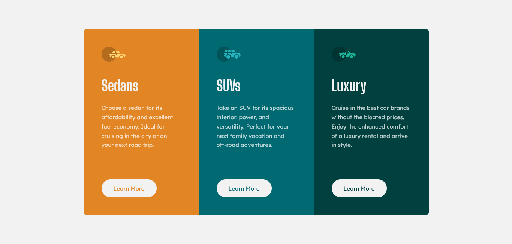

### Frontend Mentor - 3 column preview card component

Solution for the [3-column preview card component - challenge on Frontend Mentor](https://www.frontendmentor.io/challenges/3column-preview-card-component-pH92eAR2-)

### Built with
- Semantic HTML5 markup
- CSS Cascade Layers for advanced architecture
- SCSS / SASS (Variables, Mixins, Partials)
- CSS Flexbox & CSS Grid
- Mobile-first Responsive Design
- Web Accessibility (A11y) best practices

### What I learned
In this project, my primary focus was on writing clean, maintainable, and scalable code while ensuring a **pixel-perfect** implementation of the provided design. 

To achieve a modern, production-level standard, I focused on several key practices:
- Modern CSS Architecture: I utilized CSS Cascade Layers (@layer) in combination with the BEM methodology to strictly manage CSS specificity and keep the stylesheet highly organized and modular.
- Accessibility First:I implemented Web Accessibility (A11y) guidelines, including semantic HTML tags (<article>, <main>), proper aria attributes for decorative images, and the prefers-reduced-motion media query to respect user system preferences.
- Mobile-first workflow:I built the layout from the ground up for mobile devices first, ensuring it is fully responsive and optimized for all screen sizes.
- Relative Units (rem & em): Instead of fixed pixels, I utilized relative units for typography and spacing. This improves accessibility and allows the UI to scale naturally.

### Author

- Frontend Mentor - [@MGiorgi96](https://www.frontendmentor.io/profile/MGiorgi96)
